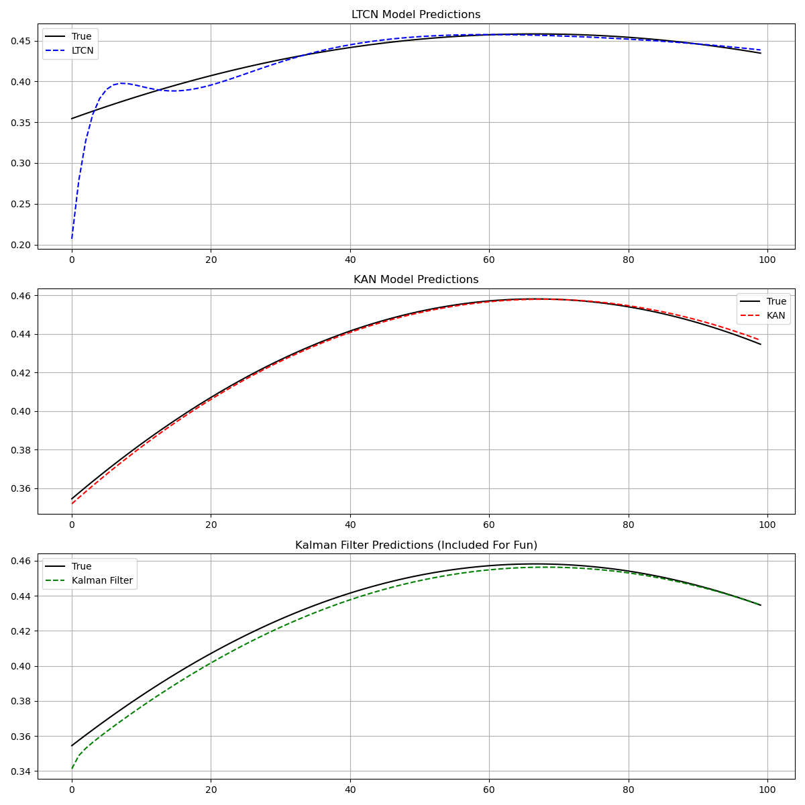

# Liquid Time-Constant Networks (LTCNs)

A novel class of time-continuous recurrent neural networks with varying time-constants.

## Mathematical Formulation

### Core Dynamics

The core equation of LTCNs:

$$\frac{dx(t)}{dt} = -\left[\frac{1}{\tau} + f(x(t), I(t))\right]x(t) + f(x(t), I(t))A$$

Essentially, we are using a leaky integrator with a fluctuating decay weight and influence factor.

Where:
- Dynamic Time-Constant: $\tau = \frac{\tau}{1 + \tau f(x(t),I(t),\theta)}$
- Bounded State: $\min(0, A^{min}_i) \leq x_i(t) \leq \max(0, A^{max}_i)$
- Bounded Time-Constant: $\frac{\tau_i}{1 + \tau_i W_i} \leq \tau^{sys}_i \leq \tau_i$

### Numerical Solver

Fused ODE solver update:

$$x(t+\Delta t) = \frac{x(t) + \Delta t \cdot f(x(t),I(t)) \cdot A}{1 + \Delta t \cdot (1/\tau + f(x(t),I(t)))}$$

Fused approximation function to calculate explicit and implicit euler methods.

# Implementation

LTCN are a continuous-time recurrent neural network where the time constant dynamically adjusts based on inputs. Here we express the cell dynamics concisely.

```python
class Cell(nn.Module):
    """Implements dx(t)/dt = -[1/τ + f(x(t),I(t))]x(t) + f(x(t),I(t))A"""
    
    def forward(self, x, I, dt):
        # Nonlinear activation
        f_val = torch.tanh(x @ self.gamma_r.T + I @ self.gamma.T + self.mu)
        
        # Fused ODE solver: x(t+Δt) = [x(t) + Δt·f·A] / [1 + Δt·(1/τ + f)]
        return (x + dt * f_val * self.A) / (1.0 + dt * ((1.0 / self.tau) + f_val))
```

The network processes time series by:s
1. Applying multiple integration steps
2. Using a fused ODE solver
3. Projecting the hidden state to output space directly after integration

This approach enables modeling complex temporal dynamics with adaptive time constants that respond to input patterns, allowing neurons to operate at different timescales at the same time.

## Results

Comparative evaluation against KAN (Kolmogorov-Arnold Networks) and the Kalman Filter for fun!




Experimental Settings:
- Experiment Params: Epochs = 250, Batch Size = 256, Learning Rate = 0.01, Adam Optimizer
- Liquid Time-Constant Networks: τ=5.0, Δt=0.01, 10 integration steps, and 32 hidden, total params: 1185
- Kolmogorov-Arnold Networks: Architecture = [1, 8, 8, 1], grid size 5, and spline degrees at 3, total params: 1280
- Kalman Filter: Oscillation frequency = 1, oscillation dampening = 0.1, state dims = 3, observation dims = 1, total params: 22

From this project, I found that LTCNs are able to approximate more complex temporal dynamics than KANs and the Kalman Filter.
From the data we can see that LTCNs have an initial warm up time and that what you see in training is what you get in validation, while KANs appear to hide their generalization capabilities.
However, LTCNs are significantly more computationally expensive than KANs and the Kalman Filter, this may be due to my implementation decisions.


## Citation

If you use this code in your research, please cite:

```bibtex
@software{pjm2025LTCN,
  author = {Paul J Mello},
  title = {Liquid Time-Constant Networks},
  url = {https://github.com/pauljmello/Liquid-Time-Constant-Networks},
  year = {2025},
}
```

## References

[1] Hasani, R., et al. (2021). Liquid time-constant networks. AAAI, 35(9), 7657-7666.

[2] Chen, T. Q., et al. (2018). Neural ordinary differential equations. NeurIPS, 6571-6583.
